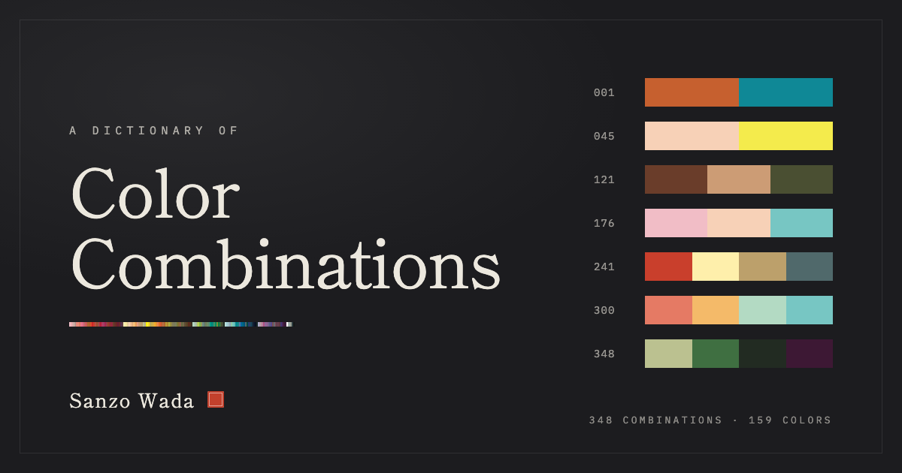

# A Dictionary of Color Combinations

An unofficial digital edition of Sanzo Wada's color combinations, read as a book you can page through.

**Read it:** https://subhranilmaity06.github.io/dictionary-of-color-combinations/

## What's inside

- 348 combinations: 001–120 use two colors, 121–240 use three, 241–348 use four
- 159 colors, each with its CMYK print recipe and screen RGB and HEX values
- A color index grouped into six families, with links to every combination a color appears in

## Reading

- Drag a page to turn it, or use the arrow buttons, the arrow keys or the page edges
- Select any swatch to see its values and the combinations that use it, as color strips
- Jump to any combination by number (`/` focuses the number field)
- Links can point at a combination, for example [`#c241`](https://subhranilmaity06.github.io/dictionary-of-color-combinations/#c241)
- Add it to your home screen to use it like an app; it works offline after the first visit

Two-page spreads show on wide screens and landscape phones; portrait phones and tablets show one page at a time. Pages re-flow to fit the screen.

## About the data

The color list and every combination number were checked against the printed color index: 159 colors and 348 combinations. Screen colors are converted from the CMYK recipes with a generic print profile, so they are close to the printed swatches but not identical. Use the CMYK values for print work. Within each combination, colors are listed in index order.

## Credits

Combinations by Sanzo Wada (1883–1967), first published as *Haishoku Soukan* (1933–34). Many of the English color names come from Robert Ridgway's *Color Standards and Color Nomenclature* (1912).

Typefaces: Shippori Mincho, Zen Kaku Gothic New and IBM Plex Mono, all under the SIL Open Font License.

This edition is for study and is not affiliated with any publisher.
